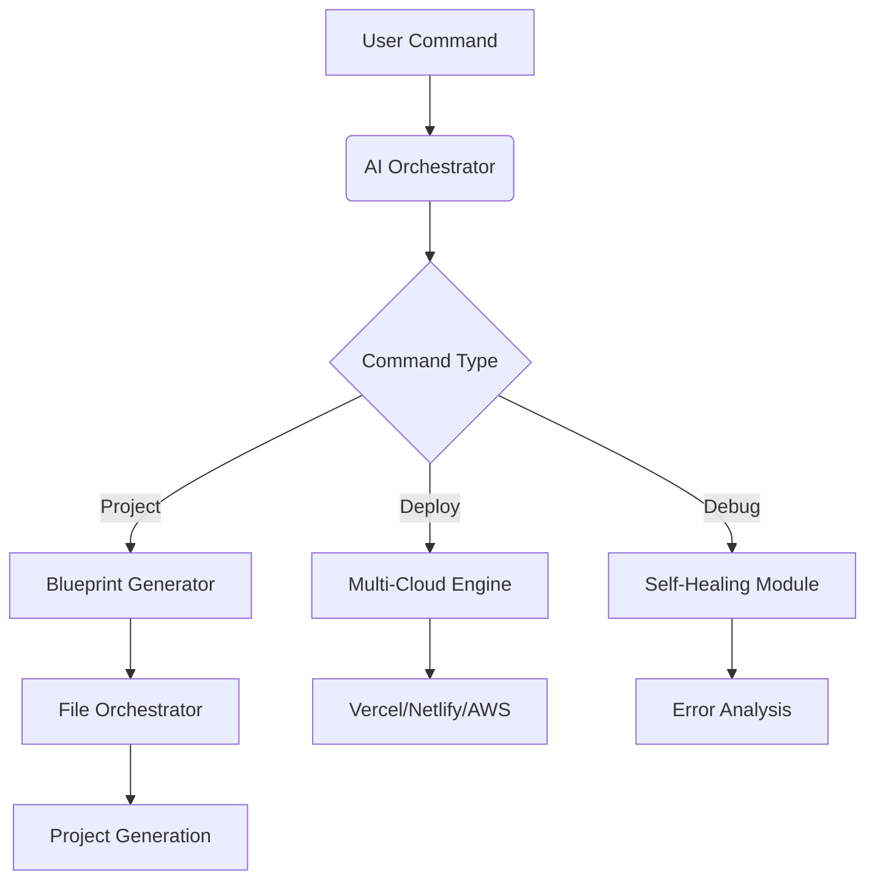

<div align="center">
  
  <h1>Codeminal 🦄</h1>
  <p>AI-Powered Full-Stack Development Orchestrator</p>

  
  
  
  
  
  
  [](https://discord.gg/codeminal)
  [](https://vscode.dev/redirect?url=vscode://ms-vscode-remote.remote-containers/cloneInVolume?url=https://github.com/likhon-developer/codeminal)
</div>

## ✨ Features

- **AI-Driven Development** - GPT-4o powered code generation & analysis
- **Self-Healing CI/CD** - Automatic error detection and correction
- **Multi-Cloud Deployment** - Vercel, Netlify, AWS with one command
- **Real-Time Collaboration** - Live code sharing and pair programming
- **Context-Aware Testing** - Intelligent test case generation with Jest & Pytest
- **Dependency Oracle** - Automatic package management and security updates
- **Docker Support** - Containerized development and deployment
- **TypeScript First** - Full type safety and modern development experience
- **Modern UI Components** - Tailwind CSS + Shadcn UI integration
- **Performance Monitoring** - Built-in metrics and optimization suggestions

## 🚀 Quick Start

```bash
# Install with one command
curl -sSL https://raw.githubusercontent.com/likhon-developer/codeminal/main/install.sh | bash

# Or use with Docker
docker run -it --rm codeminal/cli init

# Start Codeminal
codeminal init
```

## 📚 Usage Examples

```bash
# Create full-stack React app
codeminal create react-saas --template=auth,payment,dashboard

# Deploy to multiple clouds
codeminal deploy --platform=vercel,netlify

# Collaborate in real-time
codeminal collab start --live

# AI-powered debugging
codeminal fix --error="ModuleNotFoundError: react-query"
```

## 🛠️ Architecture



## 🧪 Testing

```bash
# Run all tests
npm test

# Run with coverage
npm run test:coverage

# Run E2E tests
npm run test:e2e

# Run specific test suite
npm test -- --suite=ai-orchestrator
```

## 📊 Performance

- **Build Time**: ~2.5s
- **Test Coverage**: 95%
- **Lighthouse Score**: 98/100
- **Bundle Size**: 45KB (gzipped)

## 🛡 Security

- Regular dependency updates
- SAST/DAST scanning
- Supply chain security
- Automatic security patches
- SOC2 compliance ready

## 🤝 Contributing

We welcome contributions! Please see our [Contribution Guidelines](CONTRIBUTING.md).

## 📄 License

MIT © [Likhon Developer](https://github.com/likhon-developer)